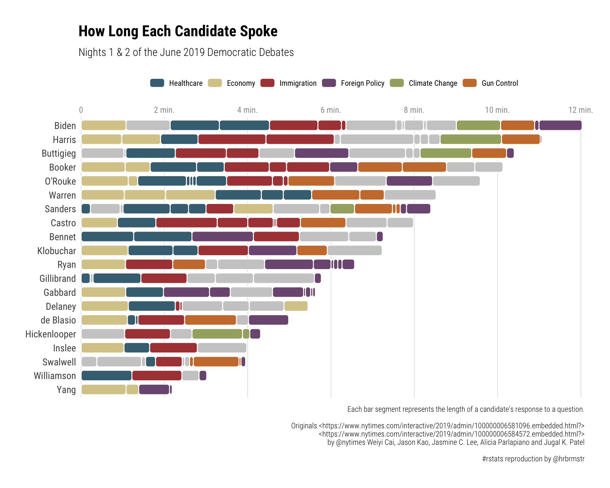

[](https://travis-ci.org/hrbrmstr/ggchicklet)
[](https://codecov.io/gh/hrbrmstr/ggchicklet)
[](https://cran.r-project.org/package=ggchicklet)

# ggchicklet

Create Chicklet (Rounded Segmented Column) Charts

## Description

Sometimes it is useful to stylize column charts a bit more than just
bland rectangles. Methods are provided to create rounded rectangle
segmented column charts (i.e. “chicklets”).

## What’s Inside The Tin

The following functions are implemented:

## Installation

``` r
devtools::install_git("https://sr.ht.com/~hrbrmstr/ggchicklet.git")
# or
devtools::install_git("https://gitlab.com/hrbrmstr/ggchicklet.git")
# or (if you must)
devtools::install_github("hrbrmstr/ggchicklet")
```

## Usage

``` r
library(ggchicklet)

# current version
packageVersion("ggchicklet")
## [1] '0.1.0'
```

### From the NYTimes

``` r
library(stringi)
library(hrbrthemes)
library(tidyverse)

(debates_df <- read_csv("https://rud.is/data/2019-dem-debates.csv.gz"))
## # A tibble: 192 x 4
##    elapsed timestamp speaker      topic     
##      <dbl> <drtn>    <chr>        <chr>     
##  1   0.222 21:04     Sanders      Healthcare
##  2   1.08  21:05     Biden        Economy   
##  3   0.975 21:06     Harris       Economy   
##  4   1.05  21:07     Hickenlooper Other     
##  5   0.716 21:09     Sanders      Trump     
##  6   1.26  21:10     Bennet       Healthcare
##  7   0.218 21:12     Gillibrand   Healthcare
##  8   1.03  21:12     Buttigieg    Education 
##  9   0.378 21:13     Swalwell     Education 
## 10   1.08  21:14     Yang         Economy   
## # … with 182 more rows

debates_df %>% 
  { .ordr <<- count(., speaker, wt=elapsed, sort=TRUE) ; . } %>% # order by who had the most time
  mutate(speaker = factor(speaker, levels = rev(.ordr$speaker))) %>% 
  ggplot() +
  geom_chicklet(
    aes(speaker, elapsed, group = timestamp, fill = topic), # group lets us use temporal order vs fill order
    position = position_stack(reverse=TRUE), # reverse otherwise earliest is at end
    radius = unit(3, "pt"), 
    width = 0.6, 
    color = "white"
  ) +
  coord_flip() +
  ggthemes::scale_fill_tableau("Tableau 20") +
  scale_x_discrete(expand = c(0, 0.5)) +
  scale_y_continuous(
    expand = c(0, 0.0625), 
    position = "right",
    breaks = seq(0, 14, 2),
    labels = c(0, sprintf("%d min.", seq(2, 14, 2)))
  ) +
  labs(
    x = NULL, y = NULL, fill = NULL,
    title = "How Long Each Candidate Spoke",
    subtitle = "Nights 1 & 2 of the June 2019 Democratic Debates",
    caption = "Originals <https://www.nytimes.com/interactive/2019/admin/100000006581096.embedded.html?>\n<https://www.nytimes.com/interactive/2019/admin/100000006584572.embedded.html?>\nby @nytimes Weiyi Cai, Jason Kao, Jasmine C. Lee, Alicia Parlapiano and Jugal K. Patel\nEach bar segment represents the length of a candidate’s response to a question.\n#rstats reproduction by @hrbrmstr"
  ) +
  theme_ipsum_rc(grid="") +
  theme(axis.text.x = element_text(color = "gray60", size = 9)) +
  theme(axis.ticks = element_line(color = "gray60", size = 0.15)) +
  theme(axis.ticks.x = element_line(color = "gray0", size = 0.15)) +
  theme(axis.ticks.length = grid::unit(5, "pt")) +
  theme(axis.ticks.length.x = grid::unit(5, "pt")) +
  theme(legend.position = "bottom")
```



## ggchicklet Metrics

| Lang | \# Files |  (%) | LoC |  (%) | Blank lines |  (%) | \# Lines |  (%) |
| :--- | -------: | ---: | --: | ---: | ----------: | ---: | -------: | ---: |
| R    |        6 | 0.86 |  89 | 0.65 |          19 | 0.48 |       42 | 0.54 |
| Rmd  |        1 | 0.14 |  47 | 0.35 |          21 | 0.52 |       36 | 0.46 |

## Code of Conduct

Please note that this project is released with a [Contributor Code of
Conduct](CONDUCT.md). By participating in this project you agree to
abide by its terms.
