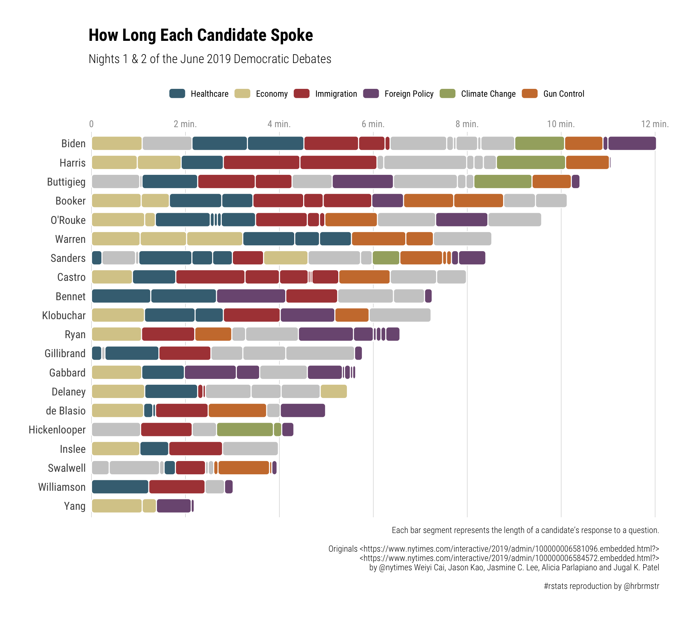

[](https://travis-ci.org/hrbrmstr/ggchicklet)
[](https://codecov.io/gh/hrbrmstr/ggchicklet)
[](https://cran.r-project.org/package=ggchicklet)

# ggchicklet

Create Chicklet (Rounded Segmented Column) Charts

## Description

Sometimes it is useful to stylize column charts a bit more than just
bland rectangles. Methods are provided to create rounded rectangle
segmented column charts (i.e. “chicklets”).

## What’s Inside The Tin

The following functions are implemented:

## Installation

``` r
install.packages("ggchicklet", repos = "https://cinc.rud.is")
# or 
devtools::install_git("https://git.rud.is/hrbrmstr/ggchicklet.git")
# or 
devtools::install_git("https://git.sr.ht/~hrbrmstr/ggchicklet")
# or
devtools::install_gitlab("hrbrmstr/ggchicklet")
# or
devtools::install_bitbucket("hrbrmstr/ggchicklet")
# or (if you must)
devtools::install_github("hrbrmstr/ggchicklet")
```

## Usage

``` r
library(ggchicklet)

# current version
packageVersion("ggchicklet")
## [1] '0.1.0'
```

### From the NYTimes

``` r
library(hrbrthemes)
library(tidyverse)

data("debates2019")

debates2019 %>%
  mutate(speaker = fct_reorder(speaker, elapsed, sum, .desc=FALSE)) %>%
  mutate(topic = fct_other(
    topic,
    c("Immigration", "Economy", "Climate Change", "Gun Control", "Healthcare", "Foreign Policy"))
  ) %>%
  ggplot(aes(speaker, elapsed, group = timestamp, fill = topic)) +
  geom_chicklet(width = 0.75) +
  scale_y_continuous(
    expand = c(0, 0.0625),
    position = "right",
    breaks = seq(0, 14, 2),
    labels = c(0, sprintf("%d min.", seq(2, 14, 2)))
  ) +
  scale_fill_manual(
    name = NULL,
    values = c(
      "Immigration" = "#ae4544",
      "Economy" = "#d8cb98",
      "Climate Change" = "#a4ad6f",
      "Gun Control" = "#cc7c3a",
      "Healthcare" = "#436f82",
      "Foreign Policy" = "#7c5981",
      "Other" = "#cccccc"
    ),
    breaks = setdiff(unique(debates2019$topic), "Other")
  ) +
  guides(
    fill = guide_legend(nrow = 1)
  ) +
  coord_flip() +
  labs(
    x = NULL, y = NULL, fill = NULL,
    title = "How Long Each Candidate Spoke",
    subtitle = "Nights 1 & 2 of the June 2019 Democratic Debates",
    caption = "Each bar segment represents the length of a candidate’s response to a question.\n\nOriginals <https://www.nytimes.com/interactive/2019/admin/100000006581096.embedded.html?>\n<https://www.nytimes.com/interactive/2019/admin/100000006584572.embedded.html?>\nby @nytimes Weiyi Cai, Jason Kao, Jasmine C. Lee, Alicia Parlapiano and Jugal K. Patel\n\n#rstats reproduction by @hrbrmstr"
  ) +
  theme_ipsum_rc(grid="X") +
  theme(axis.text.x = element_text(color = "gray60", size = 10)) +
  theme(legend.position = "top")
```



## ggchicklet Metrics

| Lang | \# Files |  (%) | LoC |  (%) | Blank lines |  (%) | \# Lines |  (%) |
| :--- | -------: | ---: | --: | ---: | ----------: | ---: | -------: | ---: |
| R    |        9 | 0.82 | 123 | 0.51 |          27 | 0.37 |      105 | 0.54 |
| Rmd  |        2 | 0.18 | 116 | 0.49 |          46 | 0.63 |       90 | 0.46 |

## Code of Conduct

Please note that this project is released with a [Contributor Code of
Conduct](CONDUCT.md). By participating in this project you agree to
abide by its terms.
