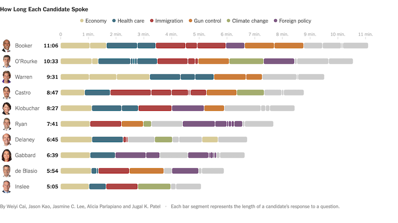

```{r, include = FALSE}
knitr::opts_chunk$set(
  message = FALSE,
  warning = FALSE,
  collapse = TRUE,
  comment = "## "
)
```

The New York Times reporters [kept track of the candiate speaking time spent per-topic](https://www.nytimes.com/interactive/2019/admin/100000006581096.embedded.html) for the June 2019 initial U.S. Democratic debates. They used a segmented, rounded-corner bar chart --- ordered by timestamp --- that I've dubbed a "chicklet" chart since they look like the fairly well-known gum/candy. This is the image from one of them:



The rounded corners aesthetic looked great and said feature begat the creation of {ggchicklet}.

Let's load up the packages we'll need:

```{r setup}
library(hrbrthemes) # my preferred theme
library(ggchicklet) # this pacakge!
library(dplyr) # we need to do a bit of data wrangling
library(forcats) # so we include {dplyr} and {forcats}
library(ggplot2) # duh!
```

If you peek at the source code for the New York Times javascript-created charts you'll see 
that all the data is right there. Rather than make you figure out how to wrangle it, a majority
subset has been included in the package and can be accessed via:

```{r data}
data("debates2019")

head(debates2019, 10)
```

The `elapsed` column contains how long the candidate spoke and `timestamp` is the time they started speaking. We'll use both to control the look and feel of the {ggchicklet} chart.

There are also candidates:

```{r data-ex-01}
debates2019 %>% 
  filter(debate_group == 1) %>% 
  filter(night == 1) %>% 
  distinct(speaker) %>% 
  arrange(speaker) %>% 
  print(n=nrow(.))
```

and the topics debates:

```{r data-ex-02}
debates2019 %>% 
  filter(debate_group == 1) %>% 
  filter(night == 1) %>% 
  distinct(topic) %>% 
  arrange(topic) %>% 
  print(n=nrow(.))
```

First, we'll use `forcats::fct_reorder()` to reorder the `speaker`s by total speaking time to
make it easier to compare the differences in total time spoken between candidate. 

Then, we'll use `forcats::fct_other()` to limit the number of `topic`s to only those highlighted
by the New York Times (and to show how to do that).

We need to use `group = timestamp` to ensure the segments are ordered by time (vs category/topic) 
and `fill = topic` to color them appropriately. Note that just using `fill = topic` would group 
the segments by topic.

```{r chicklet, fig.width=600/72, fig.height=600/72}
debates2019 %>%
  filter(debate_group == 1) %>% 
  mutate(speaker = fct_reorder(speaker, elapsed, sum, .desc=FALSE)) %>%
  mutate(topic = fct_other(
    topic,
    c("Immigration", "Economy", "Climate Change", "Gun Control", "Healthcare", "Foreign Policy"))
  ) %>%
  ggplot(aes(speaker, elapsed, group = timestamp, fill = topic)) +
  geom_chicklet(width = 0.75) +
  scale_y_continuous(
    expand = c(0, 0.0625),
    position = "right",
    breaks = seq(0, 14, 2),
    labels = c(0, sprintf("%d min.", seq(2, 14, 2)))
  ) +
  scale_fill_manual(
    name = NULL,
    values = c( # NYTimes colors
      "Immigration" = "#ae4544",
      "Economy" = "#d8cb98",
      "Climate Change" = "#a4ad6f",
      "Gun Control" = "#cc7c3a",
      "Healthcare" = "#436f82",
      "Foreign Policy" = "#7c5981",
      "Other" = "#cccccc"
    ),
    breaks = setdiff(unique(debates2019$topic), "Other")
  ) +
  guides(
    fill = guide_legend(nrow = 1)
  ) +
  coord_flip() +
  labs(
    x = NULL, y = NULL, fill = NULL,
    title = "How Long Each Candidate Spoke",
    subtitle = "Nights 1 & 2 of the June 2019 Democratic Debates",
    caption = "Each bar segment represents the length of a candidate’s response to a question.\n\nOriginals <https://www.nytimes.com/interactive/2019/admin/100000006581096.embedded.html?>\n<https://www.nytimes.com/interactive/2019/admin/100000006584572.embedded.html?>\nby @nytimes Weiyi Cai, Jason Kao, Jasmine C. Lee, Alicia Parlapiano and Jugal K. Patel\n\n#rstats reproduction by @hrbrmstr"
  ) +
  theme_ipsum_rc(grid="X") +
  theme(axis.text.x = element_text(color = "gray60", size = 10)) +
  theme(legend.position = "top")
```

You can use `ggplot2::geom_col()` to create a similar chart without the rounded rectangles but `geom_chicklet()` sets some useful defaults:

- "`white`" stroke for the chicklet/segment (`geom_col()` has `NA` for the stroke)
- automatic reversing of the `group` order (`geom_col()` uses the standard sort order)
- radius setting of `unit(3, "pt")` 
- chicklet legend geom

You will need to modify `colour`/`color` to use something besides "`white`" if you are using
a non-white background and do not want a white stroke. Larger width chicklet segments may 
look better with a larger radius.

Note also that the `group`ing column does not need to be a time-like object; any type of 
ordered column will work to set the display order.

